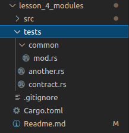

# Lesson 4: Modules

[back](https://github.com/On0n0k1/Tutorial_NEAR_Rust/tree/main/EN/)

In this lesson we will talk about organizing our code and using modules.

We could have all our code in a single `lib.rs` file, but this would file would increase in size and complexity very fast, and it would also be very difficult to organize a large project around a single file with all our code in it.

Here's some ways we can organize our code: 

 - We can declare external modules; 
 - We can declare directories as modules;
 - We can control when our modules are public (can be used by anyone);
 - We can control the path for each public module;
 - We can put our tests in a `./tests/` directory. 

---

## Contract API

```rust
/// Returns the stored String
pub fn get_phrase(&self) -> String;

/// This function will print "Hello from crate::a_module"
/// and store that value
pub fn hello(&mut self);

/// This function will print "Hello from crate::a_module::specific_module"
/// and store that value
pub fn hello1(&mut self);

/// This function will print "Hello from another module" 
/// and store that value
pub fn hello2(&mut self);

/// This function will print "Hello from yet_another_module" 
/// and store that value
pub fn hello3(&mut self);

/// This function will print "Called a deep function"
/// and store that value
pub fn hello4(&mut self);

/// This function will panic and print "A panic just happened"
/// when called
pub fn this_will_panic();
```

---

## Topics
 - [How to declare an external module](#how-to-declare-an-external-module)
 - [How to use a file or directory as a module](#how-to-use-a-file-or-directory-as-a-module)
 - [Using or Importing modules](#using-or-importing-modules)
   - [Aliases](#aliases)
   - [Public access](#public-access)
 - [Tests](#tests)
   - [NEAR integration tests](#near-integration-tests)
   - [Rust tests](#rust-integration-tests)
  - [Disable compiler warnings](#disable-compiler-warnings)
  - [Testing errors](#testing-errors)

---

## How to declare an external module

[top](#topics)

An external module must be declared prior to using or importing it.

```rust
mod yet_another_module;
```

This declaration tells the compiler there is a module with this name in the same directory. There are three ways to declare a module. If two or more modules with the same name are found, an ambiguity error will be raised.

The module above is private, so it can be used where it was declared. We can turn it public by using:

```rust
pub mod a_module;
```

`a_module` is now public... this means that it can be imported by other code, including external crates.
If you want to restrict that, you can write:

```rust
pub(crate) fn hello() -> String{
    String::from("Hello from crate::a_module::specific_module")
}
```
`pub(crate)` means this function will only be public in this crate. This means that if `lesson_4_modules` was a dependency of another project, that crate would not have access to this function.

---

## How to use a file or directory as a module

[top](#topics)

We can use a file or directory as a module, and there are two ways to do it. 

The first one: 
 - Create a directory with the name we want for our module.
 - Create a file with name `mod.rs` inside that directory. This file will be our module's implementation.


 In the above image, directory `a_module` with a `mod.rs` is our module.

The second one:
  - Create a Rust file with the same name as our module. This file is the module's implementation.


`internal_module.rs` is our module and the file contains the module's implementation.

---

## Using or Importing modules

[top](#topics)

You can import modules, functions, structs, traits and enums by using the `use` keyword.

Let's look at an example: below, we are bringing both `env` and `near_bindgen` from `near_sdk` (which happens to be a crate in this case) into scope. 

```rust
use near_sdk::{env, near_bindgen};
```
Just keep in mind that you actually don't have to use `use` (pun intended). If we wanted to, we could access `env` by writing `near_sdk::env` every time we needed it (meaning, write the full path).

---

### Aliases

[top](#topics)

We can use the `as` keyword to alias an import to another name:

```rust
use a_module::specific_module::hello as hello1;
```
There are a few `hello` functions in this example. Let's alias their names using the `as` keyword. In the above example, calling `hello1()` will be the same as calling `a_module::specific_module::hello()`.

---

### Public access

[top](#topics)

Let's see some ways to organize access to modules and functions:

```rust
pub use another_module::hello as hello2;
pub use yet_another_module::hello as hello3;
```

The above will bring both `hello` functions into scope, aliasing `hello2` and `hello3` while making them public; just as-if they were declared in this module. 

If we had a file `yet_another_module.rs` with:
```rust
mod internal_module;

pub use internal_module::a_deep_module::a_deep_function;
```
We are declaring `internal_module` exists and is private. However, we are also bringing `a_deep_function` into scope **and** making it public; and so, you can access this function using the path `yet_another_module::a_deep_function` without even knowing (or caring) that function resides in a completely different directory. 

Organize your modules (and directories) according to your project's needs, and then use `pub use` to export or make items available for external users. 

:hand: `pub use` and `pub mod` are used for public modules and crates when using them as libraries in other projects. These are language features and have no relation to NEAR contracts. 

:warning: Remember Rust changes often, so be sure to keep up-to-date. You can always check the docs for the [Rust Editions](https://doc.rust-lang.org/edition-guide/rust-2018/path-changes.html).

---

## Tests

[top](#topics)

NEAR has its own way to do testing which is different than Rust's tests; the former are more so integration tests while the latter are unit tests. This is because NEAR's tests are more about simulating interaction between different smart contracts on the blockchain.

---

### NEAR integration tests

[top](#topics)

The testing tool commonly used for testing NEAR Smart Contracts is called [workspaces-rs](https://github.com/near/workspaces-rs).

But just to complicate things, there's _also_ something called **workspaces** in Rust, but they are very different things. A [Workspace](https://doc.rust-lang.org/cargo/reference/workspaces.html) in Rust is a collection of one or more packages that share dependencies, target and other settings such as profiles.

Integration testing was done with the crate [near-sdk-sim](https://www.near-sdk.io/testing/simulation-tests), but this tool will deprecated in favor of the [sandbox](https://docs.near.org/docs/develop/contracts/sandbox).

---

### Rust integration tests

[top](#topics)

We usually declare our tests in the same file: 

```rust
#[cfg(test)]
mod tests{
    // load everything from this module
    use super::*;

    #[test]
    fn hello_test(){
```

But most of the time, we declare tests in their own directory and with their own file structure. 
We can create a directory `tests` alongside `src`.



We can then execute `cargo test`, and every `.rs` file will be treated as a test. All functions with an attribute of `#[test]` will be executed automatically. You can just place tests in `.rs` files, there's no need to create a `mod` for them. 

For our lesson, the directory `tests` acts as a separate crate. Let's import the `common` module found under `tests`, and bring it into scope in `contract.rs`.

```rust
mod common;

use common::env_setup;
```
To import modules in the same create, we can use the crate's name: 

```rust
use lesson_4_modules::Contract;
```

---

## Disable compiler warnings

[top](#topics)

Warnings are sometimes generated during compilation, but you can opt-out of them by using attributes before code: 

```rust
#[allow(unused)]
```
The above attribute would allow unused code to exist following the attribute and not generate a compiler warning.

However, you should always fix any compiler warnings and not ignore them. But here's an example when these attributes come in handy: the naming convention for JavaScript is to use `CamelCase`, while the naming convention for Rust is `snake_case`. If we are interacting with a contract using near-api-js, readability could be improved by using JavaScript's naming convention. 

```rust
#[allow(non_snake_case)]
pub fn ACamelCaseFunction() {    
```

We could also allow to ignore any warnings related to imports not being used:

```rust
#[allow(unused_imports)]
use near_sdk::{env, near_bindgen};
```
While these can sometimes be useful, **please** get into the habit of **fixing any warnings**, and do not ignore or hide them from the compiler by using attributes.

---

## Testing errors

[top](#topics)

We can also create tests that expect an error, and therefore testing in this manner guarantees that we are also taking care of any possible (expected) errors in our functions. 

```rust
    #[test]
    #[should_panic(expected = "A panic has just happened")]
    fn this_will_panic_test() {
        this_will_panic();
    }
```

The function above is **expected** to panic, and therefore when it does, our test passes.

On the flip side, if our functions doesn't panic or does so with a different message that the one we specified, our test will fail. 

Lesson 4 :white_check_mark: ... **Done! Congratulations!**

Our [next lesson](https://github.com/On0n0k1/Tutorial_NEAR_Rust/tree/main/EN/lesson_5_macro_usage) will be about Rust's modules.