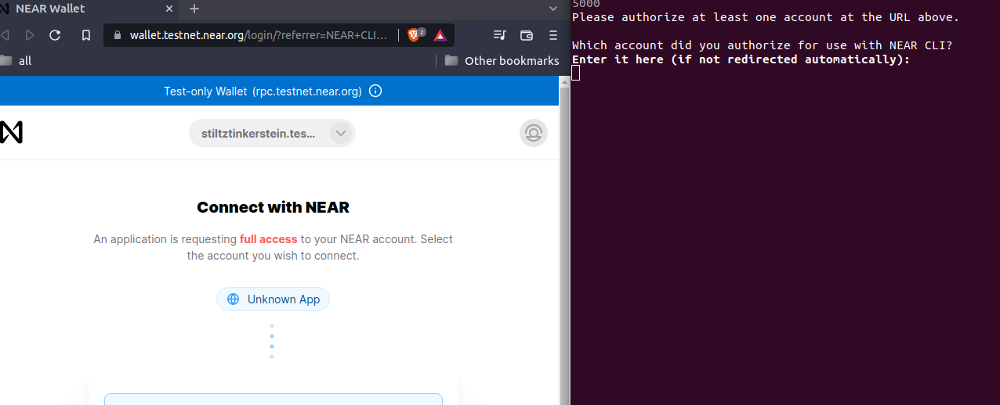

# Introdução a near-cli

Near CLI ("command line interface") é a ferramenta que utilizamos para interagir com o protocolo blockchain. Documentação completa sobre near-cli no [tutorial](https://docs.near.org/docs/tools/near-cli).

## Conta NEAR (Simplificado)

Uma conta NEAR pode ser vista como uma carteira. Podemos transferir NEAR, receber, executar funções em contratos inteligentes de outras contas, criar chaves de acesso com certas permissões, etc.

Um smart contract pode ser implementado em uma conta NEAR, mas não é obrigatório para que essa exista. Cada conta ou sub-conta NEAR só pode ter um contrato de cada vez. Mas uma conta NEAR pode ser mestre (permissões administrativas) de várias sub-contas.

Ou seja, quando precisarmos de implementar vários contratos, podemos distribui-los em uma hierarquia de diversas contas com maior segurança. As subcontas só precisam das permissões necessárias para seus objetivos. As subcontas só precisam da quantidade de gas necessárias para se manterem em operação.

**gas**: É NEAR gasto para computação, armazenamento de dados, criação de contas, etc. A cada clock de computação, uma fração de NEAR é consumida da conta. As máquinas que mantém nosso sistema em funcionamento devem ser recompensadas, por isso utilizamos **gas** é consumido.

## Lista de Comandos

Discutiremos alguns comandos a seguir:
 - [Login](#login)
 - [Checar State](#checar-state-estado)
 - [Criar Sub-conta](#criar-sub-conta)
 - [Implantar Contrato](#implantar-contrato)
   - [Evitando Inicialização Sem argumentos](#evitando-inicializa%C3%A7%C3%A3o-sem-argumentos)
 - [Executar Funções de Contrato](#executando-funções-do-contrato)
   - [View](#view)
   - [Call](#call)
 - [Deletar Sub-Conta](#deletar-sub-conta)

## Login
[topo](#introdu%C3%A7%C3%A3o-a-near-cli)

```bash
near login
```



Não é a nossa máquina que executa as funções de contrato descentralizadas. A nossa conta na blockchain que faz isso. Nós conectamos a uma conta testnet com este comando.

**testnet**: é uma plataforma de teste NEAR. Os tokens não tem valor e não é possivel comercializá-los. A plataforma oficial é a **mainnet**. Garanta que não há riscos no contrato antes de implementar para produção.

## Checar State (Estado)
[topo](#introdu%C3%A7%C3%A3o-a-near-cli)

```bash
near state stiltztinkerstein.testnet
```

Podemos checar o estado de qualquer conta na blockchain. É informação pública.


Lembrar que esta é uma conta **testnet**. Não é dinheiro de verdade. Os atributos que conseguimos são estes:

 - **amount**: Quantidade de NEAR na conta em yocto Near. ```1 * 10²⁴ = 1 NEAR```.
 - **block_hash**: Hash do bloco;
 - **block_height**: Altura do bloco;
 - **code_hash**: Se o hash de código for uma sequência de "1", então nenhum smart contract foi implementado nesta conta;
 - **locked**: Quantidade de NEAR trancado?*;
 - **storage_paid_at**: Custo de armazenamento?*;
 - **storage_usage**: Uso de armazenamento?*;
 - **formattedAmount**: **amount** formatado para NEAR.

*: Quem tiver mais informações sobre os detalhes com *, agradeceria um pull-request.

## Criar sub-conta
[topo](#introdu%C3%A7%C3%A3o-a-near-cli)

Podemos criar uma subconta com um comando semelhante a este:

```bash
near create-account minha-subconta.minha-conta.testnet --masterAccount minha-conta.testnet --initialBalance 10
```

 - **nome-da-conta.minha-conta.testnet**: Nome da subconta que criei;
 - **minha-conta.testnet**: nome da conta mestre;
 - **masterAccount**: conta mestre;
 - **initialBalance 10**: Opcional. A conta mestre enviará 10 NEAR para a subconta;

Para criar uma conta de topo nível, use [near-api-js](https://docs.near.org/docs/api/naj-cookbook#create-account).

## Implantar Contrato
[topo](#introdu%C3%A7%C3%A3o-a-near-cli)

```bash
near deploy --accountId minha-subconta.minha-conta.testnet --wasmFile ./compilado.wasm
```

Após compilar nosso projeto (cheque o [tutorial cargo](https://github.com/On0n0k1/Tutorial_NEAR_Rust/blob/main/EN/static/tutorials/cargo.md)), usamos este comando para implantar o arquivo compilado em nossa subconta.

 - **accountId**: ID da conta em que implantaremos o contrato;
 - **wasmFile**: Caminho para o arquivo webassembly compilado;

O estado inicial deste contrato será a trait ```Default``` que implementamos no código rust. Essa trait não recebe parâmetros para inicialização. Se quisermos usar um construtor com parâmetros de inicialização, precisamos de seguir dois passos:

O primeiro passo é declarar um construtor com marcador ```#[init]```. Exemplo:

```rust
#[init]
pub fn new(title: String, data: String, category: i8) -> Self {
```

O nome da função ```new``` não é obrigatório. Mas é convenção criar construtores com este nome.

O segundo passo é incluir os parâmetros ```--initFunction``` e ```--initArgs``` para inicializar o contrato com a função e argumentos, respectivamente.

O comando de implantação poderia ser chamado da seguinte forma:

```bash
near deploy --accountId minha-subconta.minha-conta.testnet --wasmFile ./compilado.wasm --initFunction new --initArgs '{"title": "um-titulo", "data": "link-para-dados", "category": 3 }'
```

### Evitando inicialização sem argumentos
[topo](#introdu%C3%A7%C3%A3o-a-near-cli)

A trait ```Default``` é um requisito para o funcionamento do contrato, mesmo se não pretendermos utilizá-la. Se a inicialização com argumentos for essencial para o funcionamento do contrato, podemos fazer com que o processo entre em pânico caso o sistema tente inicializar com ```Default```.

Duas forma de causar "panic em ```Default```" são descritos a seguir:

Na implementação de ```Default```:
```rust
impl Default for Contract{
    fn default() -> Self{
        panic!("The contract is not initialized");
    }
}
```

Derivando ```PanicOnDefault``` na declaração de ```Contract```:

```rust
#[near_bindgen]
#[derive(BorshDeserialize, BorshSerialize, PanicOnDefault)]
pub struct Contract{
```

Ambas as alternativas fazem exatamente a mesma coisa.

## Executar funções do contrato
[topo](#introdu%C3%A7%C3%A3o-a-near-cli)

Existem dois tipos de funções de contrato:
 - **view**: Não realiza computação e não altera estado do contrato. Não consome gás. Ou seja, é de graça.
 - **call**: Todos os outros tipos de função. Consomem gás. Podem necessitar um pagamento. A implementação da função pode incluir outras restrições, como restrições de chave, restrições de usuário, et cetera.

### View
[topo](#introdu%C3%A7%C3%A3o-a-near-cli)

Para facilitar o entendimento, vale lembrar que o estado de todos os contratos são publicos.

Se uma função simplesmente retorna um valor armazenado no estado, então pode ser uma função view. Funções view não consomem gás, e não precisam de pagamento.

Funções view não podem realizar nenhum cálculo, e não podem alterar o estado do contrato.

Usaremos o contrato abaixo como exemplo:

```rust
#[near_bindgen]
#[derive(BorshDeserialize, BorshSerialize)]
pub struct Contract{
    counter: i32,
    nome: String,
}
```

Os exemplos abaixo são exemplos válidos para funções view:

```rust
#[near_bindgen]
impl Contract{
    pub fn get_counter(&self) -> i32 {
        // i32 implementa Copy
        self.counter
    }

    pub fn get_counter1(&self) -> i32 {
        // O mesmo que get_counter
        return self.counter;
    }

    pub fn get_nome(&self) -> String {
        // String não implementa copy
        // Strign implementa Clone
        self.nome.clone()
    }

    pub fn get_nome1(&self) -> String {
        // O mesmo que get_nome
        return self.nome.clone();
    }
}
```

Uma breve explicação sobre alguns traits. Para um tipo implementar Copy, este precisa de implementar Clone.

Se um tipo implementar Clone, podemos criar uma cópia desse tipo com o método ```clone()```. Se um tipo implementar Copy, a cópía será feita automaticamente quando necessário. A instrução seguinte para i32:

```rust
return self.counter;
```

Se counter não implementasse ```Copy``` ou ```Clone```, teriamos um erro. Porque transferimos esse endereço de variável para outro lugar. Counter não teria um valor, pois a "ownership" foi perdida. O compilador não irá permitir essa transferência.

O exemplo a seguir **não** pode ser função view.

```rust
pub fn um_numero() -> i32 {
    5
}
```

Embora a função simplesmente retorna um número, é ainda considerada computação. Relembrando, funções view apenas retornam o valor de um estado do contrato (que é informação pública).

#### Executando uma função view
[topo](#introdu%C3%A7%C3%A3o-a-near-cli)

```bash
near view minha-subconta.minha-conta.testnet get_counter '{}'
```

### Call
[topo](#introdu%C3%A7%C3%A3o-a-near-cli)

Qualquer outro tipo de função que não é ```view```, é ```call```.

Para o contrato abaixo...

```rust
#[near_bindgen]
#[derive(BorshDeserialize, BorshSerialize)]
pub struct Contract{
    counter: i32
}
```

... temos o exemplo de função ```call``` a seguir:

```rust
#[near_bindgen]
impl Contract{
    pub fn increment(&mut self) -> i32 {
        self.counter += 1;
        self.counter
    }
}
```

Exemplo retirado da "lição 1 - contratos". Incrementa counter em 1, e retorna o valor.

Podemos chamar a função da seguinte forma:

```bash
near call minha-subconta.minha-conta.testnet increment '{}' --account-id minha-conta.testnet
```

## Deletar Sub-Conta
[topo](#introdu%C3%A7%C3%A3o-a-near-cli)

```bash
near delete minha-subconta.minha-conta.testnet minha-conta.testnet
```

O primeiro argumento é o nome da sub-conta a deletar. O segundo argumento é o nome da conta que irá receber todo o NEAR armazenado.
