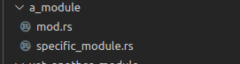

# Lição 4 - Módulos

[voltar](https://github.com/On0n0k1/Tutorial_NEAR_Rust/tree/main/)

Esta lição discute sobre como módulos são importados. 

Podemos ter todo nosso código implementado no arquivo ```lib.rs```. Mas percebe-se como seria dificil de organizar um projeto grande dessa forma. 

 - Podemos declarar módulos externos; 
 - Declarar diretórios externos como módulos;
 - Controlar quais módulos são públicos;
 - Controlar o caminho para cada módulo público;
 - Também podemos organizar nossos testes no diretório ```./tests/```.

## API de Contrato

```rust
/// Retorna a String armazenada.
pub fn get_phrase(&self) -> String;

/// A função irá imprimir "Hello from crate::a_module" e 
/// atribuir essa string ao valor armazenado.
pub fn hello(&mut self);

/// A função irá imprimir "Hello from 
/// crate::a_module::specific_module" e atribuir essa string ao 
/// valor armazenado.
pub fn hello1(&mut self);

/// A função irá imprimir "Hello from another module" e 
/// atribuir essa string ao valor armazenado.
pub fn hello2(&mut self);

/// A função irá imprimir "Hello from yet_another_module" 
/// e atribuir essa string ao valor armazenado.
pub fn hello3(&mut self);

/// A função irá imprimir "Called a deep function" e 
/// atribuir essa string ao valor armazenado.
pub fn hello4(&mut self);

/// Esta função irá entrar em pânico com a mensagem "A panic 
/// just happened" quando chamado.
pub fn this_will_panic();
```

## Tópicos
 - [Como declarar um módulo externo](#como-declarar-um-m%C3%B3dulo-externo)
 - [Como declarar e usar diretórios](#como-declarar-e-usar-diret%C3%B3rios)
 - [Usando/importando módulos](#usandoimportando-m%C3%B3dulos)
   - [Apelidos](#apelidos)
   - [Usos públicos](#usos-p%C3%BAblicos)
 - [Testes de integração](#testes-de-integra%C3%A7%C3%A3o)
   - [Testes de integração NEAR](#testes-de-integra%C3%A7%C3%A3o-near)
   - [Testes de integração Rust](#testes-de-integra%C3%A7%C3%A3o-rust)
  - [Desativar avisos de compilador](#desativar-avisos-de-compilador)
  - [Testando Falhas](#testando-falhas)

## Como declarar um módulo externo

[topo](#li%C3%A7%C3%A3o-4---m%C3%B3dulos)

Um módulo externo deve ser declarado antes de usado/importado.

```rust
mod yet_another_module;
```

Essa linha diz ao compilador que existe um módulo com este nome no mesmo diretório. Existem três formas de se declarar um módulo. Se dois módulos ou mais com mesmo nome forem encontrados, um erro de ambiguidade será gerado.

O módulo acima é privado. Só pode ser usado onde foi declarado. O módulo abaixo é público:

```rust
pub mod a_module;
```

```a_module``` é público aqui. Ou seja, pode ser importado por outros. Isso inclui crates externas. O exemplo abaixo restringe isso.

```rust
pub(crate) fn hello() -> String{
    String::from("Hello from crate::a_module::specific_module")
}
```

```pub(crate)``` significa que esta função é pública apenas nessa crate. Ou seja, se ```lesson_4_modules``` for dependência de um outro projeto rust, o crate externo não terá acesso a essa função.

## Como declarar e usar diretórios

[topo](#li%C3%A7%C3%A3o-4---m%C3%B3dulos)

Podemos declarar diretórios como módulos também. Existem duas formas para isso. A primeira é:
 - Criar um diretório com o nome do seu módulo.
 - Criar um arquivo com nome ```mod.rs``` dentro desse diretório. Este arquivo possui a implementação do módulo.



```a_module``` é uma implementação de módulo. 

A segunda forma é:

 - Criar um diretório com o nome do seu módulo.
 - Criar um arquivo rust com o mesmo nome do seu módulo junto com o diretório. Este arquivo possui a implementação do módulo.


```internal_module``` é outra implementação de módulo.

O arquivo rust fica dentro ou fora do diretório? Essa é a questão.

## Usando/Importando módulos

[topo](#li%C3%A7%C3%A3o-4---m%C3%B3dulos)

Qualquer item (módulos, funções, structs, traits, enums, et cetera) pode ser importado com a instrução use.

No exemplo abaixo, acessamos o caminho ```near_sdk``` (uma crate neste caso), e incluimos ```env``` e ```near_bindgen``` no nosso namespace.

```rust
use near_sdk::{env, near_bindgen};
```

Não é necessário usar a instrução use. Porém, se quiséssemos acessar o módulo ```env```, teriamos que escrever ```near_sdk::env``` todas as vezes.

### Apelidos

[topo](#li%C3%A7%C3%A3o-4---m%C3%B3dulos)

Podemos dar um apelido ao item importado:

```rust
use a_module::specific_module::hello as hello1;
```

Existem várias funções ```hello``` neste exemplo. Então alteramos o nome de cada uma com o operador ```as```. Ou seja, importando dessa forma, a instrução ```hello1()``` é o mesmo que ```a_module::specific_module::hello()```.

### Usos públicos

[topo](#li%C3%A7%C3%A3o-4---m%C3%B3dulos)

As instruções

```rust
pub use another_module::hello as hello2;
pub use yet_another_module::hello as hello3;
```

Trazem as duas funções hello para este namespace, alteram o nome para ```hello2``` e ```hello3```, e as tornam públicas, como se tivessem sido declaradas neste módulo. Isso é uma boa forma de organizar nosso projeto. Por exemplo, no arquivo ```yet_another_module```:

```rust
mod internal_module;

pub use internal_module::a_deep_module::a_deep_function;
```

Declaramos que o módulo ```internal_module``` existe, e é privado. Mas a função ```a_deep_function``` é pública. Um usuário pode acessar esse item pelo caminho ```yet_another_module::a_deep_function```. Sem saber que a função está em um diretório completamente diferente.

Organize módulos e diretórios de acordo com as necessidades do seu projeto. Use ```pub use``` para organizar os itens disponíveis de acordo com as necessidades dos usuários externos.

**Detalhe**: ```pub use``` e ```pub mod``` são usados para módulos públicos e crates feitos para serem importados (library) por outros projetos rust. Não possui nenhuma interação no contexto de contratos NEAR.

## Testes de Integração

[topo](#li%C3%A7%C3%A3o-4---m%C3%B3dulos)

A linguagem rust tem um formato para testes de integração, e o formato NEAR possui outro.

Isso porque testes de integração em NEAR consistem na interação entre diversos contratos em uma simulação de estrutura blockchain.

### Testes de Integração NEAR

[topo](#li%C3%A7%C3%A3o-4---m%C3%B3dulos)

Para isso usamos uma ferramenta chamada [workspaces-rs](https://github.com/near/workspaces-rs)

Agora, como se ja não estivesse confuso o suficiente, workspaces em rust e workspaces-rs são duas coisas diferentes. [Workspaces](https://doc.rust-lang.org/cargo/reference/workspaces.html) em rust são uma forma de organizar várias crates em um único pacote, todas compartilhando um diretório ```./target/``` e um arquivo ```Cargo.lock```. [workspaces-rs](https://github.com/near/workspaces-rs) é uma forma de realizar testes de integração de contratos NEAR utilizando a linguagem rust.

Testes de integração eram feitos com a crate [near-sdk-sim](https://www.near-sdk.io/testing/simulation-tests), mas esta ferramenta será deprecada pela [sandbox](https://docs.near.org/docs/develop/contracts/sandbox). Use a ferramenta que lhe servir melhor.

### Testes de integração Rust

[topo](#li%C3%A7%C3%A3o-4---m%C3%B3dulos)

Geralmente declaramos testes no mesmo arquivo. da seguinte forma:

```rust
#[cfg(test)]
mod tests{
    // carrega tudo que está neste arquivo, fora deste módulo.
    use super::*;

    #[test]
    fn hello_test(){
```

Mas as vezes, precisamos declarar testes em sua própria estrutura de arquivos e diretórios.

Podemos criar um diretório ```tests``` junto com o ```src```.


Quando executarmos o comando ```cargo test```, cada arquivo ```.rs``` será tratado como um módulo de teste. Todas as funções marcadas com ```#[test]``` serão executadas automaticamente.

Os arquivos ```.rs``` não precisam ser declarados com a instrução ```mod``` para serem compilados.

O diretório ```tests``` age como uma crate separada. Podemos importar módulos no mesmo diretório:

```rust
mod common;

use common::env_setup;
```

Para importarmos módulos na crate principal, referimos à essa pelo nome da crate:

```rust
use lesson_4_modules::Contract;
```

## Desativar avisos de compilador

[topo](#li%C3%A7%C3%A3o-4---m%C3%B3dulos)

Avisos ("warnings") são gerados durante a compilação. Podemos desativar avisos da seguinte forma:

```rust
#[allow(unused)]
```

O exemplo acima permite uma falha de código "não utilizado" na linha abaixo.

O recomendado é corrigir avisos do compilador. Mas existem situações em que talvez isso seja útil. Por exemplo, a convenção para funções javascript é ```CamelCase```, mas a convenção para funções em rust é ```snake_case```. Quando comunicarmos com o nosso contrato através do near-api-js, talvez seja melhor ter as funções na convenção javascript.

```rust
#[allow(non_snake_case)]
pub fn ACamelCaseFunction() {    
```

Podemos permitir avisos de imports não utilizados:

```rust
#[allow(unused_imports)]
use near_sdk::{env, near_bindgen};
```

Repetindo, avisos existem para nos ajudar. O recomendado é **corrigir** os avisos, não escondê-los.


## Testando falhas

[topo](#li%C3%A7%C3%A3o-4---m%C3%B3dulos)

Criamos testes para garantir que erros aconteçam quando erros devem acontecer também.

```rust
    #[test]
    #[should_panic(expected = "A panic has just happened")]
    fn this_will_panic_test() {
        this_will_panic();
    }
```

O teste acima irá causar pânico, mas esperamos pânico. Então o teste será um sucesso.

Se a operação não causar pânico, ou causar pânico com uma mensagem diferente do esperado ("expected"). O teste irá falhar.

A próxima lição será sobre...
