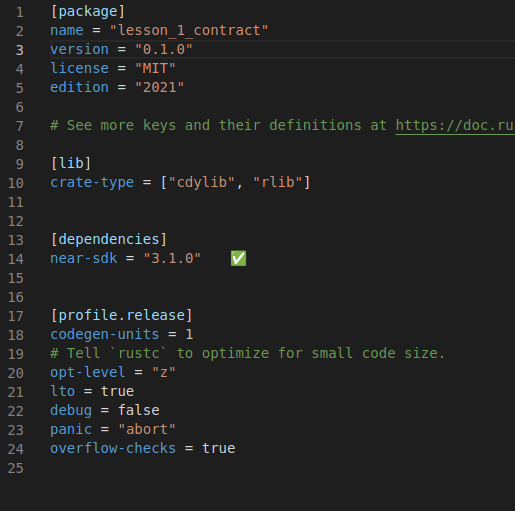
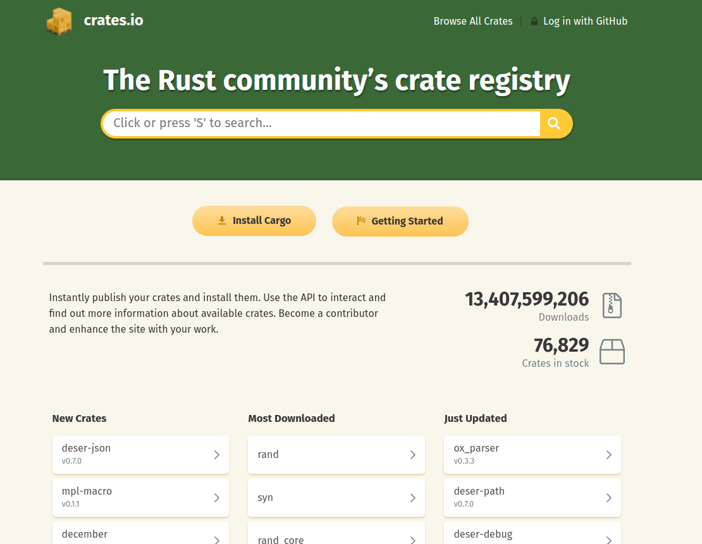

# Introdução a Cargo

Cargo é a ferramenta que usamos para administrar nossos projetos da linguagem rust. Documentação completa sobre Cargo no [livro Cargo](https://doc.rust-lang.org/cargo/).

## Cargo.toml

Semelhante a ```package.json``` para ```node.js```, este arquivo possui todas as informações meta sobre este diretório. Características como nome e versão, mas também configurações sobre como o projeto deve ser compilado.



Não é necessário saber tudo sobre essas configurações. As configurações que precisaremos alterar são ```[package]``` e ```[dependencies``` de projeto em projeto. A seguir, descrevemos os tópicos principais:
 - **package**: Configurações sobre a crate. Nome, versão, licensa, edição do Rust, etc; 
 - **lib**: Isso determina que esta crate não é um executável. E sim é uma biblioteca que será acessada externamente. ```cdylib``` quer dizer "c dynamic library", ```rdylib``` quer dizer "rust dynamic library". Acho que o compilador webassembly precisa dessas configurações.
 - **dependencies**: Aqui declaramos nossas dependencias. Podemos incluir de varias formas. O padrão é vindo do site "crates.io", mas podemos também incluir crates locais; podemos incluir através de um link github, etc.
 - **profile.release**: Configuração para projetos compilados para "release". Não é necessário entender cada instrução. Simplesmente fala para o compilador tentar optimizar o máximo possivel, quando um erro (panic) acontece, finaliza o runtime, et cetera.


## O que é crate?

**Crate** (caixa) representa um diretório com um arquivo "Cargo.toml".

Geralmente, cada crate gera um diretório "target" com o arquivo compilado. Mas se criarmos um workspace, que é um conjunto de várias crates compartilhando um "Cargo.toml", os arquivos compilados são todos agrupados na mesma pasta. Para mais detalhes, cheque a lição sobre workspaces.

Podemos publicar nossas crates no site [crates.io](https://crates.io/).

### Crates.io

Dependências como ```near_sdk``` são baixadas deste site. Qualquer desenvolvedor rust pode compartilhar projetos neste site, com **uma condição**: Deve ser open-source.

O site intencionalmente não disponibiliza opção para compartilhar crates de forma privada.



Para impedir que projetos quebrem de forma inesperada, se retirarmos uma versão do registry usando o comando "yank", projetos não poderão mais baixar a versão, mas ainda continuarão funcionando se tiverem a versão baixada.

## Comandos Cargo

Segue uma lista simplificada de comandos cargo que podemos utilizar durante desenvolvimento de contratos NEAR.

 - build: compila o projeto.
 - test: executa testes de unidade.

Só isso. Existem vários outros comandos que podemos executar com cargo. Mas não são necessários para novos desenvolvedores. Cheque o [livro Cargo](https://doc.rust-lang.org/cargo/).

### Cargo build

Precisamos compilar o projeto para webassembly, sem uma arquitetura especificada. Para isso usamos:

```bash
cargo build --release --target wasm32-unknown-unknown
```

 - ```release``` corta todas as partes da compilação feitas para auxiliar o debug e otimiza o código para produção
 - ```target``` determina a arquitetura alvo para o projeto. Escolhemos webassembly.

**Aviso**: Essa instrução irá resultar em **erro** se não instalarmos ```wasm32-unknown-unknown``` na lista de alvos da linguagem rust. Para isto, basta executar a seguinte instrução (apenas uma vez para cada instalação).

```bash
rustup target add wasm32-unknown-unknown
```

### Cargo test

Realiza todos os testes de unidade no projeto. Se uma função possui o marcador ```#[test]```, essa função será executada.

Testes de unidade simplesmente procuram por situações de pânico. Se um pânico inesperado acontece, ou um pânico esperado não acontece, o teste falha.

Macros como panic, assert e assert_eq são usados para garantir nossas condições.
 - ```panic!("Mensagem");```: Causa pânico com a dada mensagem.
 - ```assert!(condicao, "Mensagem");```: Causa pânico se a condição for falsa. Está "garantindo" que a condição será verdadeira.
 - ```assert_eq!(primeiro, segundo, "Mensagem");```: Compara ```primeiro == segundo```. Se forem diferentes, causa pânico com a dada mensagem.

Exemplo de situação em que não esperamos panic:

```rust
#[test]
fn oneplusone() {
    assert_eq!(1 + 1, 2);
}
```

1+1 é sempre igual a 2. Então nunca haverá panic.

Exemplo de situação em que esperamos panic:

```rust
#[test]
#[should_panic(expected = "A panic has just happened")]
pub fn this_will_panic() {
    env_setup();

    let _contract: Contract = Contract::default();

    Contract::this_will_panic();
}
```

Este é um exemplo da "lição 4 - módulos". A função ```this_will_panic()``` é uma função que eu criei que sempre causa pânico.

```#[should_panic]``` significa que o teste vai falhar se não entrar em panic. ```expected``` especifica qual a mensagem de pânico esperada.

Isso é tudo sobre testes para contrato. Para simular a comunicação entre contratos, precisamos de utilizar workspaces-rs.


[Voltar](https://github.com/On0n0k1/Tutorial_NEAR_Rust)


