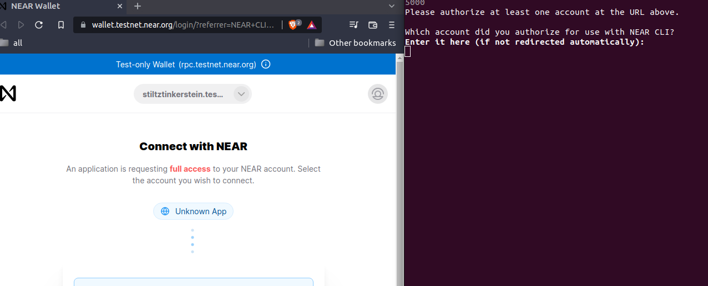
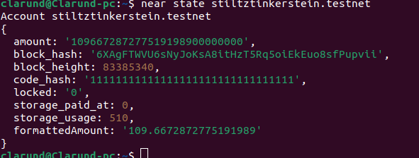

# Introdução a near-cli

Near CLI ("command line interface") é a ferramenta que utilizamos para interagir com o protocolo blockchain. Documentação completa sobre near-cli no [tutorial](https://docs.near.org/docs/tools/near-cli).

## Conta NEAR (Simplificado)

Uma conta NEAR pode ser vista como uma carteira. Podemos transferir NEAR, receber, executar funções em contratos inteligentes de outras contas, criar chaves de acesso com certas permissões, etc.

Um smart contract pode ser implementado em uma conta NEAR, mas não é obrigatório para que essa exista. Cada conta ou sub-conta NEAR só pode ter um contrato de cada vez. Mas uma conta NEAR pode ser mestre (permissões administrativas) de várias sub-contas.

Ou seja, quando precisarmos de implementar vários contratos, podemos distribui-los em uma hierarquia de diversas contas com maior segurança. As subcontas só precisam das permissões necessárias para seus objetivos. As subcontas só precisam da quantidade de gas necessárias para se manterem em operação.

**gas**: É NEAR gasto para computação, armazenamento de dados, criação de contas, etc. A cada clock de computação, uma fração de NEAR é consumida da conta. As máquinas que mantém nosso sistema em funcionamento devem ser recompensadas, por isso utilizamos **gas** é consumido.

## Comandos

Discutiremos alguns comandos a seguir:
 - login

### Login

```bash
near login
```



Não é a nossa máquina que executa as funções de contrato descentralizadas. A nossa conta na blockchain que faz isso. Nós conectamos a uma conta testnet com este comando.

**testnet**: é uma plataforma de teste NEAR. Os tokens não tem valor e não é possivel comercializá-los. A plataforma oficial é a **mainnet**. Garanta que não há riscos no contrato antes de implementar para produção.

### Checar State (Estado)

```bash
near state stiltztinkerstein.testnet
```

Podemos checar o estado de qualquer conta na blockchain. É informação pública.



Lembrar que esta é uma conta **testnet**. Não é dinheiro de verdade. Os atributos que conseguimos são estes:

 - **amount**: Quantidade de NEAR na conta em yocto Near. ```1 * 10²⁴ = 1 NEAR```.
 - **block_hash**: Hash do bloco;
 - **block_height**: Altura do bloco;
 - **code_hash**: Se o hash de código for uma sequência de "1", então nenhum smart contract foi implementado nesta conta;
 - **locked**: Quantidade de NEAR trancado?*;
 - **storage_paid_at**: Custo de armazenamento?*;
 - **storage_usage**: Uso de armazenamento?*;
 - **formattedAmount**: **amount** formatado para NEAR.

*: Quem tiver mais informações sobre os detalhes com *, agradeceria um pull-request.

### Criar sub-conta

Podemos criar uma subconta com um comando semelhante a este:

```bash
near create-account nome-da-conta.minha-conta.testnet --masterAccount minha-conta.testnet --initialBalance 10
```

 - **nome-da-conta.minha-conta.testnet**: Nome da subconta que criei;
 - **minha-conta.testnet**: nome da conta mestre;
 - **masterAccount**: conta mestre;
 - **initialBalance 10**: Opcional. A conta mestre enviará 10 NEAR para a subconta;

Para criar uma conta de topo nível, use [near-api-js](https://docs.near.org/docs/api/naj-cookbook#create-account).

